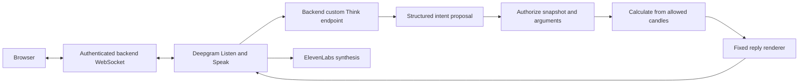

# Backend design and integration contract

This document records the September 12, 2026 decisions and the implemented
shared contracts. It is a design for the backend, not a claim that its services
are running. The frontend can integrate against
[`@hackrice/contracts`](../packages/contracts/src/index.ts).

## Outcome and scope

The MVP presents a historical SOL/USDT chart with future candles hidden. Users
ask for numerical calculations, draw their own conclusions, submit a thesis,
review evidence, reveal the outcome, and retain their learning history.

The backend owns candle access, chart snapshots, deterministic calculations,
spoken content, account/session authorization, submissions, reveal, and
deletion. The frontend owns rendering, drawings, recording, and playback.
Runtime validation is shared across both through the contracts package.

The handbook specifies September 13 at 9:00 a.m. Central as the submission
deadline. Its finance track emphasizes personal wealth management; the
gamification track explicitly includes learning games. The present product's
stronger fit with gamified learning is an interpretation, not an eligibility
decision. Do not add budgeting or trading to pursue a prize.

## Selected stack

The user selected TypeScript/Node.js after comparison with Python and Go.
Better Auth runs natively in TypeScript. Python would require an additional
JavaScript authentication host; Go would add that boundary and more direct
provider HTTP integration. No application measurements justify claiming that
the language itself is the dominant voice-latency factor.

| Responsibility | Choice |
| --- | --- |
| Runtime and contracts | TypeScript/Node.js and Zod |
| Authentication | Better Auth email/password |
| Authoritative database | TigerData PostgreSQL |
| Candle storage | Timescale candle hypertable with relational metadata |
| Voice connection | Browser to backend WebSocket to Deepgram Voice Agent |
| Speech output | ElevenLabs through Deepgram Speak |
| Learning memory | Backboard, asynchronously synchronized |
| Chart integration | TradingView Lightweight Charts, proposed replacement |
| Market history | Binance SOLUSDT public historical data, verified candidate |
| Private recordings | Object storage, provider still to be selected |

The backend is one application with modules. Redis, separately deployed
microservices, and live-market streaming have no demonstrated MVP necessity.
Better Auth owns its authentication schema; generate it with its current CLI
when authentication is implemented. Keep authentication sessions separate from
replay sessions. No Better Auth implementation or generated schema exists yet.

## Voice and the no-advice boundary

All user-visible assistant prose comes from a fixed renderer. The implemented
`SafeReply` schema accepts calculation facts, selected concept IDs, and
selected refusal IDs. It rejects extra text, arbitrary labels, and positive
calculation offsets. `renderSafeReply` produces the same text for the same
validated input; neither user drawing labels nor model prose enter it.

Configure a backend-owned, OpenAI-compatible Deepgram Think endpoint. Its
internal model can propose a supported intent and numerical arguments. It
cannot supply final prose. The endpoint authorizes the frozen snapshot,
computes the requested facts, and returns the rendered response to Deepgram.
If extraction, authorization, or calculation fails, return an appropriate
fixed refusal. All greetings, errors, injections, and interruption responses
must use the same controlled content path.

Do not configure a managed Think fallback: it would create an uncontrolled
speech path. The use of one controlled endpoint is derived from this safety
requirement, not a performance quota. Validate live provider behavior before
enabling playback. Deepgram's `ConversationText` is not a pre-speech approval
hook, and `InjectAgentMessage` alone does not disable autonomous Think.

This design can enforce that only approved text reaches synthesis. It cannot
prove that a neural speech provider reproduces every word perfectly. A literal
guarantee about every audible word requires reviewed prerecorded speech or
text-only output. No integration test has yet established the runtime boundary.

The calculation layer must independently verify fact IDs and values. A schema
can reject an extra field; it cannot prove that a numeric value came from the
authorized database slice. Never trust model-supplied numeric results.

## Historical data and chart behavior

Solana's client API provides blockchain state and transactions. It does not
provide exchange SOL/USDT candles. Retain the original pair; do not silently
replace USDT with USDC or exchange candles with a DEX pool.

The public Binance market-data endpoint was tested with the complete UTC day
of January 1, 2024. It returned consecutive closed rows: 288 at 5 minutes,
96 at 15 minutes, and 24 at 1 hour. This proves a feasible demo seed, not a
representative training dataset or accessibility from every deployment region.
For the first integration, import that verified sample as a labeled seed,
persist its source and digest, and determine eligible cutoffs from actual data.
The provider's 1,000-row request maximum is an API constraint, not a corpus size
or application limit. Additional archive imports are justified only if the
actual configured indicators and reveal horizon leave no eligible scenario.

Ingest canonical 5-minute candles as exact decimal values. Derive 15-minute and
1-hour candles from these same records. TigerData supports normal PostgreSQL
clients and time-series aggregation. For decimal parity, explicit SQL
`numeric` OHLCV aggregation can be used; do not silently convert authoritative
calculations to floating point for a convenience aggregate.

At a UTC hour cutoff H, expose only candles ending at or before H under the
internal half-open interval convention. For a provider that timestamps its
last included millisecond, this is `closeTime < H`. The bar opening at H is
future data. Exclude incomplete higher-timeframe bars. User authorization,
session state, and cutoff validation apply to every query and cache access.

The initial chart range is the available pre-cutoff seed history. Panning can
request that history; no fixed day or candle cap is invented. Show the server's
same indicator series at every zoom level so zooming never changes its seed.

The public API represents historical times as minute offsets from the cutoff:
zero is the replay boundary, negative is historical, and positive is revealed
future. A 15-minute candle immediately before the cutoff opens at -15 and
closes at 0. Real market epochs, source archive names, and historical news never
appear in public pre-reveal DTOs, prompts, error details, or Backboard memories.
Actual account/session creation timestamps are distinct and can be public.
The frontend maps relative offsets to synthetic chart times without using
real historical dates; this mapping stays stable through timeframe changes.

Historical prices and shapes can still be matched externally. The app can
prevent its own future-data disclosure; it cannot guarantee users never identify
a historical period. Exclude dated news from the blind MVP. Consider source-
dated news only after reveal in a future request; it needs its own trustworthy
publication-time data and is not required for this implementation.

TradingView Advanced Charts needs private repository access. Public hackathon
deployment does not grant access. Lightweight Charts is the accessible
alternative, with required attribution; its drawing and indicator overlays
need frontend implementation. This contracts package does not implement those
overlays or commit proprietary chart assets.

## Calculation and evaluation semantics

Requests specify indicator periods explicitly. The exported demo preset uses
EMA 9, RSI 14, and relative volume over the preceding 10 bars. These values
come from TradingView's published defaults and ordinary relative-volume
definition, selected as the technical reference for familiar chart behavior;
they are not optimized thresholds or claims of financial predictive power.
The original EMA 20 example does not become a default. Supported formulas are
EMA, RSI, and relative volume; arbitrary expression evaluation is excluded.

- EMA uses close prices, seeds with the arithmetic mean of the first requested
  period of closes, then uses alpha = 2 / (period + 1).
- RSI uses Wilder smoothing over close-to-close changes. Seed with the first
  requested period of gains and losses, requiring one additional close. If
  both average gain and loss are zero, return unavailable instead of inventing
  a directional interpretation. Zero loss with positive gain yields 100;
  zero gain with positive loss yields 0.
- Relative volume divides the selected completed candle's volume by the mean
  of the preceding requested number of completed candles, excluding itself.
  Use base-asset SOL volume consistently. This is ordinary relative volume,
  not TradingView CEX screener's USD-converted variant or volume-at-time.
  A zero denominator yields unavailable.
- Insufficient input yields `insufficient_data`; do not change the period or
  fabricate a value. Persist seed, formula version, source range, unit, and
  rounding policy with the calculated facts when implementing storage.

These are explicit proposed calculation definitions for the implementation;
they are not evidence that indicators are implemented or financially predictive.
Prices remain decimal strings in transport. Display rounding must derive from
venue precision metadata; indicators need a documented display policy before
UI rendering. Full-precision stored facts drive validation.

The submission horizon is explicit at session creation and remains fixed when
the user changes the displayed timeframe. The accepted timeframes also define
the available horizons: 5 minutes, 15 minutes, or 1 hour. An hour is the proposed
demo selection because it is the common coarsest supported chart resolution;
the API does not hide a default. Compare the last allowed close with the close
at that horizon. `unchanged` means exact equality at canonical venue precision;
no invented neutral-price threshold is used. This evaluates a price direction,
not profitability after fees, spread, or execution.

Preserve the original rubric weights, but attach an evidence status to each
finding: supported, contradicted, insufficient evidence, or not assessable.
`score: null` and `overallScore: null` are valid when scoring is unjustified.
Do not label an LLM's self-reported percentage as calibrated confidence. The
user's confidence remains their own 0-100 estimate. The stored score-meaning
field explicitly distinguishes educational rubric feedback from a validated
prediction probability. A backend evaluator must verify evidence references,
derive the weighted total itself, and never use post-cutoff candles to grade
pre-reveal reasoning. Freeform evaluations stay internal until converted to
approved reason codes and templates.

## HTTP integration

`httpContracts` defines each method, path, request validator, and response
validator. The first implementation uses same-origin frontend and API routing,
Better Auth secure session cookies, and origin validation on mutations and
WebSocket upgrades. Provider credentials never enter a shared schema.
Better Auth owns `/api/auth/*`; its generated API is not reimplemented here.

| Operation | Method and path |
| --- | --- |
| Create/list sessions | POST/GET `/api/sessions` |
| Read/delete session | GET/DELETE `/api/sessions/:sessionId` |
| Save/read context | PATCH/GET `/api/sessions/:sessionId/chart-context` |
| Fetch complete candles | GET `/api/sessions/:sessionId/chart/bars` |
| Ask typed question | POST `/api/sessions/:sessionId/questions` |
| Commit analysis | POST `/api/sessions/:sessionId/submissions` |
| Read evaluation | GET `/api/evaluations/:evaluationId` |
| Reveal/complete | POST `/api/sessions/:sessionId/reveal` or `/complete` |
| Save reflection | PUT `/api/sessions/:sessionId/reflection` |
| Read history | GET `/api/sessions/:sessionId/history` |
| Read deletion status | GET `/api/deletions/:deletionId` |

Return 201 for newly created sessions/submissions, 202 for accepted questions
and deletion, and 200 for other successful JSON responses. Require an
`Idempotency-Key` UUID for mutations. Scope it to authenticated user, operation,
and resource; identical retries return the recorded response, and different
payloads using the same key return 409 `idempotency_conflict`. Persist the state
change, resulting event, and response atomically. No retry count is invented.

Parse numeric query parameters from their textual URL representation before
passing them to `BarsQuery`; reject malformed values. Authorize resource
ownership before returning anything. Invalid input is 400, missing login 401,
missing or inaccessible resources 404, invalid state/revision 409, expired
session 410, and provider failure 503. Responses carry a request ID and a fixed
error code, never raw exception strings or provider payloads.

Chart updates are compare-and-swap operations: `expectedRevision` must equal
the current revision. Save a new immutable snapshot and increment the server
revision. Verify selected candles, drawing anchors, indicator availability,
and all coordinates against the session. Snapshot IDs in turns and submissions
must belong to the authenticated session. The database performs these checks;
UUID format validation alone cannot establish ownership.

Session lifecycle is `exploring -> submitted -> revealed -> completed`.
Evaluation has its own queued/processing/completed/failed state. Final
submission is immutable, and continuing pre-reveal questions does not rewrite
it. The explicit POST commits a form reviewed by the user; voice interpretation
alone cannot commit it. Reveal requires a persisted submission and exposes only
the chosen horizon. A failed evaluation remains visible and cannot manufacture
a score. Completion requires reveal and can include a reflection.

## Voice events and audio

Connect at `WS /api/realtime/sessions/:sessionId` using the same authenticated
session and verified origin. `ClientEvent` and `ServerEvent` are strict,
discriminated schemas with protocol version, event ID, and session ID. Server
events have a persisted, increasing session sequence. Client IDs deduplicate
commands; HTTP and WebSocket question paths use the same turn operation.

The client waits for `session.ready` and uses its negotiated PCM format.
`voice.start` binds a new turn ID to a frozen chart snapshot. The server verifies
that snapshot before accepting audio. One active voice turn per connection is
derived from its single microphone stream; interruption finalizes or cancels
that turn before another starts. A turn ID never identifies a second reply.

Binary frames use the RFC 9562 UUID's 16 bytes followed by complete mono signed
16-bit little-endian PCM samples. Shared `encodeAudioFrame` and
`decodeAudioFrame` helpers work in browser and server runtimes. UUID byte width
and sample width derive from those technical formats, not application quotas.
This avoids base64 audio overhead and retains turn identity for late packets.
WebSocket order carries packet order; audio is not replayed after reconnect.
Reject frames for inactive, cancelled, expired, or mismatched turns.

`assistant.response` carries a structured `SafeReply`. Render its display text
with the same function used for speech. `assistant.audio.start` identifies the
following output stream; every binary packet still includes its turn ID.
`assistant.interrupt` cancels pending work and clears playback for that turn.
Late provider completions cannot commit an evaluation or emit audio. Record
actual playback completion separately from successful generation. Final
transcripts are persisted; cancelled turns may have no final transcript.

On reconnect, `session.resume` supplies the last received server sequence.
Replay retained structured events once by event ID, never raw audio. Send
`resync_required` if recovery requires a fresh authorized history read. This
package has no invented reconnect timeout or retry count. Interim transcripts
are omitted until the chosen provider configuration proves a supported event.

## Storage, Backboard, and deletion

Use normal relational tables for Better Auth, replay sessions, immutable chart
snapshots, turns, submissions, evaluations, facts, events, and synchronization
jobs. The candle hypertable is separate from personally identifying history.
Recording objects are private and referenced by opaque recording IDs. An
authenticated binary recording download route remains an implementation task;
public history never contains permanent storage URLs.

Backboard provides memory across attempts. Use a separate assistant per user,
explicitly inserted structured learning records, and `Readonly` retrieval.
Suitable records contain stable skill/reason codes and source session IDs;
exclude raw audio, raw transcripts, real market dates, prices, outcome data,
and freeform advice. Before a new session, reduce retrieved records to known
pedagogical codes. Backboard output never bypasses the reply renderer.

Persist the Backboard assistant ID, thread ID, memory ID, source session IDs,
operation ID, and deletion status internally. Deleting a thread does not delete
assistant-scoped memory. Avoid automatic extraction from whole conversations:
it complicates source deletion and can leak previous outcomes into new attempts.
Delete all linked memories or rebuild a derived memory from surviving sources.
Persist sync jobs in TigerData; failures cannot block chart or voice use.

The user's retention requirement is 30 days or deletion on click. Give raw
audio and final transcripts an expiry based on their own creation time; use
the same cleanup operation for manual and scheduled deletion. Reject reads
as soon as deletion starts, cancel active voice, and prevent pending sync jobs
from recreating deleted data. The deletion response cannot say completed while
tracked application audio, history, or Backboard deletion remains pending.
Treat local-record deletion as including transcripts and derived findings.

Use Deepgram `mip_opt_out: true`. ElevenLabs receives controlled assistant text,
not raw user recordings. Provider backups and logging are governed by provider
policies. ElevenLabs zero-retention mode has account restrictions; do not claim
global immediate erasure based on deleting local objects or Backboard records.
Persist provider operation acknowledgments and report failures truthfully.

## Solana integration decision

The user requested Solana, but charting SOL does not itself demonstrate network
use. A proposed devnet integration commits a salted hash of the final analysis
before reveal, then presents the transaction receipt. It must not publish the
analysis, audio, account identity, or recoverable unsalted guessable payload.
The salt and commitment remain bound to the immutable submission. Transactions
and credentials are outside the shared chart-contract implementation until
the user chooses this integration. No chain writes have been performed.

## Proof and remaining work

The package compiles and tests input rejection, future-bar boundaries, safe
reply rendering, snapshot links, interrupted-turn framing, and deletion status.
These are meaningful contract checks, not substitutes for runtime tests.

The application still needs its server, generated Better Auth schema, TigerData
connection/migrations/import, calculation engine, controlled Think adapter,
Deepgram/ElevenLabs credentials, private object storage, Backboard integration,
and deployment. The host must support persistent WebSockets. No deployment
host or account credentials have been selected in this repository.

Prove the implementation in its actual environment with cross-user resource
checks, hidden-future rejection through every route, matching chart/tool values,
interruption races, idempotent submission/reveal, no uncontrolled TTS route,
and deletion that cannot be undone by delayed synchronization. Run provider
checks only when credentials are locally configured; never put secrets in chat.

## Sources

Primary sources were read on September 12, 2026. Sponsor claims are selection
context, not proof of integration, performance, or prize eligibility.

- [HackRice handbook](https://docs.google.com/document/d/1lqTThw7-FnLS0I7OSM_q0o2_Ls0L5AAMccHT4Ibrwkw/mobilebasic)
- [MLH prizes](https://www.mlh.com/events/hackrice-71/prizes)
- [Solana client libraries](https://solana.com/docs/clients)
- [Solana RPC](https://solana.com/docs/rpc/http)
- [Binance market-data-only endpoints](https://raw.githubusercontent.com/binance/binance-spot-api-docs/master/faqs/market_data_only.md)
- [Binance kline specification](https://developers.binance.com/en/docs/catalog/core-trading-spot-trading/api/rest-api/market)
- [Deepgram documentation](https://developers.deepgram.com/home)
- [Deepgram custom Think endpoints and fallbacks](https://developers.deepgram.com/docs/voice-agent-llm-models)
- [Deepgram conversation text](https://developers.deepgram.com/docs/voice-agent-conversation-text)
- [Deepgram ElevenLabs Speak](https://developers.deepgram.com/docs/voice-agent-tts-models)
- [Deepgram speculative replies](https://developers.deepgram.com/docs/voice-agent-speculative-replies)
- [Deepgram model improvement opt-out](https://developers.deepgram.com/docs/the-deepgram-model-improvement-partnership-program)
- [ElevenLabs text-to-speech](https://elevenlabs.io/docs/overview/capabilities/text-to-speech)
- [ElevenLabs zero retention](https://elevenlabs.io/docs/eleven-api/resources/zero-retention-mode)
- [Better Auth introduction](https://better-auth.com/docs/introduction)
- [Better Auth installation](https://better-auth.com/docs/installation)
- [TigerData documentation](https://www.tigerdata.com/docs)
- [TigerData integrations](https://docs.tigerdata.com/integrations/latest)
- [TigerData candle aggregation](https://docs.tigerdata.com/api/latest/hyperfunctions/financial-analysis/candlestick_agg/)
- [Backboard SDK](https://docs.backboard.io/sdk/quickstart)
- [Backboard memory modes](https://docs.backboard.io/sdk/memory)
- [Backboard threads](https://docs.backboard.io/concepts/threads)
- [Backboard memory deletion](https://docs.backboard.io/api-reference/memories/delete)
- [Backboard deletion operation status](https://docs.backboard.io/api-reference/memories/operation-status)
- [TradingView libraries](https://www.tradingview.com/free-charting-libraries/)
- [Lightweight Charts](https://tradingview.github.io/lightweight-charts/docs)
- [TradingView EMA defaults](https://www.tradingview.com/support/solutions/43000592270-exponential-moving-average/)
- [TradingView RSI defaults](https://www.tradingview.com/support/solutions/43000502338-relative-strength-index-rsi/)
- [TradingView relative-volume formula](https://www.tradingview.com/support/solutions/43000635874-how-do-we-calculate-relative-volume-and-relative-volume-at-time/)
